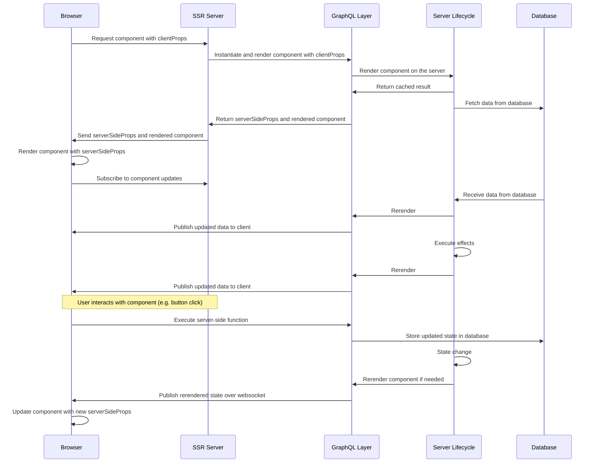

```mermaid
sequenceDiagram
participant Browser as Browser
participant Server as SSR Server
participant RSC as GraphQL Layer
participant SSP as Server Lifecycle
participant DB as Database

Browser->>Server: Request component with clientProps
Server->>RSC: Instantiate and render component with clientProps
RSC->>SSP: Render component on the server
SSP->>RSC: Return cached result
SSP->>DB: Fetch data from database
RSC->>Server: Return serverSideProps and rendered component
Server->>Browser: Send serverSideProps and rendered component
Browser->>Browser: Render component with serverSideProps

Browser->>Server: Subscribe to component updates
DB->>SSP: Receive data from database
SSP->>RSC: Rerender

RSC->>Browser: Publish updated data to client
SSP->>SSP: Execute effects
SSP->>RSC: Rerender
RSC->>Browser: Publish updated data to client
Note over Browser, Server: User interacts with component (e.g. button click)

Browser->>RSC: Execute server-side function
RSC->>DB: Store updated state in database
SSP->>SSP: State change
SSP->>RSC: Rerender component if needed
RSC->>Browser: Publish rerendered state over websocket
Browser->>Browser: Update component with new serverSideProps
```
