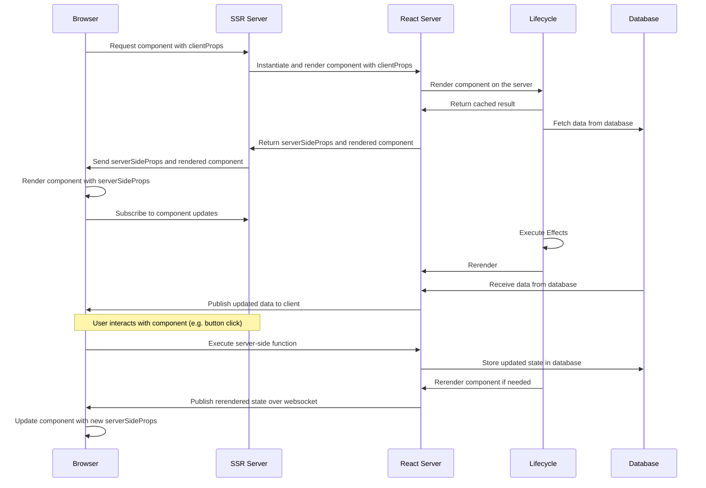

# Why?

## Because it's beautiful Reactive approach 🥰

Just like React, React Server revolutionizes coding methodologies, offering a reactive approach that tackles the challenges posed by JavaScript's asynchronous and event-driven nature. Its brilliance lies in the simplicity of semantic flow within your application.

By abstracting complex state interactions and asynchronous operations into a semantically linear data flow, React Server enhances readability, paving the way for a more maintainable codebase. A hallmark of a well-crafted codebase is its readability, akin to turning the pages of a well-written book.

React Server promotes composability and encapsulates concerns within self-contained components, fostering modularity and reducing architectural complexity. This naturally encourages a DRY (Don't Repeat Yourself) coding style, treating services as collections of states and operations.

Adhering to these principles empowers developers to swiftly prototype intricate full-stack services while upholding readability and robustness. Components, resembling self-contained microservices, encapsulate backend logic, database connections, and frontend interfaces, facilitating seamless interaction with component states.

Representing operations on states through components provides an intuitive user interface, enhancing user experience and code comprehension. Leveraging TSX as syntactic sugar for visual representation further enhances readability and code conciseness without compromising flexibility.

With React Server, you harness the full power of JavaScript while seamlessly integrating a reactive interface into the existing React framework. Note that while React Server currently relies on React for optimal functionality, you can utilize its reactive interface independently through the GraphQL API without the need for the react-client library.

Embrace the future of coding with React Server—a catalyst for streamlined development and unparalleled user experiences.

_Note: It's currently not really usable without React unless you would want to write the client logic again. However you could always speak with the GraphQL API without the need to use the `react-client` library._

## Reactive State Management

_React Server_ introduces a powerful abstraction layer for managing the asynchronous flow of stateful requests through its reactive interface. By externalizing states into databases, it facilitates a stateless architecture that can seamlessly operate on platforms like AWS Lambda.

Leveraging a reactive coding style, _React Server_ adopts familiar hooks such as useState and introduces server/client effects like **useEffect** and **useClientEffect**, mirroring React's conventions. This reactive approach ensures a linear semantic flow of code, abstracting away complex data fetching and transportation logic on the server side. Utilizing GraphQL's **PubSub** mechanism, _React Server_ enables real-time reflection of server-side component states on the client, effortlessly consumed through frontend components.

Theoretically, React Server's reactive nature enables the minimization of Time To **First Byte** (TTFB). Cached responses are initially fetched from the server, and once live data is retrieved from the database, it is promptly published to all connected clients, making it instantly available on the frontend.

The advantages of adopting a reactive coding style extend beyond improved **TTFB**. They promote clean code representations, abstracting away intricate data fetching and transportation logic, ultimately fostering readable and maintainable code bases. With _React Server_, harness the power of reactive programming to streamline state management and elevate your development experience.

## Flexibility Beyond GraphQL

Just as _GraphQL_ revolutionized API consumption by providing safe, typed data structures, _React Server_ takes this innovation a step further. Instead of consuming arbitrary data shapes, _React Server_ allows you to consume fully-fledged components, offering unparalleled flexibility in the realm of microservices.

In the context of component-based microservices, where frontend code is already modularized into reusable components, _React Server_ bridges the gap between frontend and backend by coupling frontend components with backend counterparts. These backend components encapsulate authoritative business logic, empowering you to craft highly reusable microservices deployable on any **Node.js** runtime that supports _React Server_.

What sets _React Server_ apart is its seamless communication between server and client. With a single **useComponent** call, you can obtain function references directly from the backend source code. Gone are the days of tedious HTTP requests or queries for data retrieval and action execution. Instead, you consume a component that seamlessly provides props to your frontend component. Any function rendered on the server side is automatically passed to the frontend as a callable function, facilitating seamless two-way communication. Server-side responses are promptly sent back to the client, resolving promises in real-time.

Experience the future of microservices with React Server—a paradigm shift that enhances flexibility, fosters seamless communication, and streamlines development like never before.

## Unlocking Backend Modularity

Drawing inspiration from React, React Server introduces a paradigm shift in backend development, allowing for modular code design in a declarative manner. Its component-driven approach is tailor-made for constructing intricate applications or microservices that seamlessly collaborate.

On React Server, nesting components on the backend mirrors the frontend's component structure effortlessly. This innovative feature not only facilitates code organization but also addresses the notorious waterfall problem. By precomputing all nested data required by frontend components and sending it to the client in a single response, React Server optimizes performance and enhances user experience.

_Note: This allows you to mitigate the waterfall problem by \_precomputing_ all the nested data your frontend components need and send it down to the client in one single response.__

## Streamlining Data Handling

With serverside components seamlessly managing state and business logic for your frontend counterparts, data transportation becomes a worry of the past. Simply render the component on the backend— <MyComponent key="my-key" />—and let a frontend hook take care of the rest— useComponent('my-key').

## Components Over REST APIs

Transition from traditional REST APIs, which map paths to specific functionalities, to the innovative approach of consuming components. With just a single hook, retrieve all the data required for a component, simplifying data consumption like never before.

### Server-Side React Concepts

If you're familiar with React, transitioning to server-side development is a breeze. Simply extend the concept of states and props to the server side.

A server-side component comprises states (housing the current server-side state), functions (manipulating these states), and a TSX component describing the properties exposed to users. Any JavaScript value can be rendered as props, while functions are serialized and passed to the frontend, enabling direct invocation on the currently mounted component.

Consuming a component on the frontend (or any GraphQL client) grants access to all rendered properties. The frontend automatically subscribes to server-side component changes, ensuring properties remain up to date.

Did we mention that a component is merely a function returning a TSX component? It's that straightforward.

## Lifecycle

Leveraging states and effects at the component level simplifies the construction of expansive, reactive backend applications. Breaking down the business logic of a large-scale project into multiple components and employing states facilitates the seamless integration of reactive behavior across various data segments.

